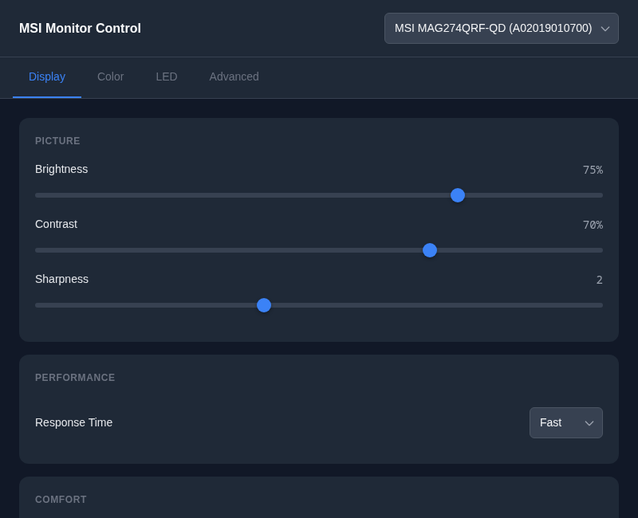
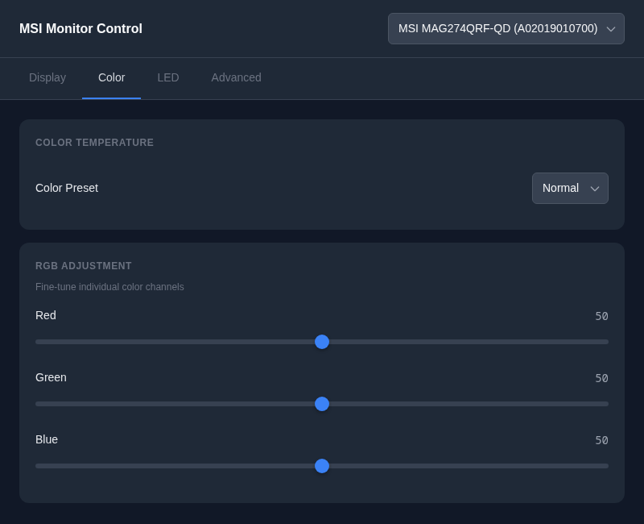
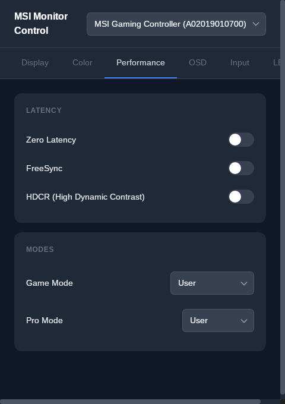
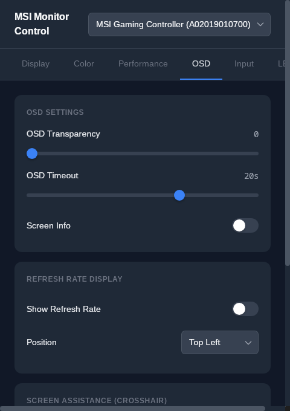
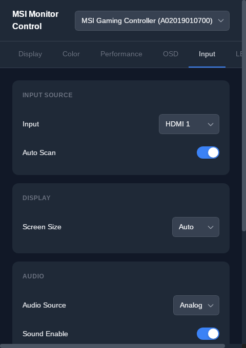
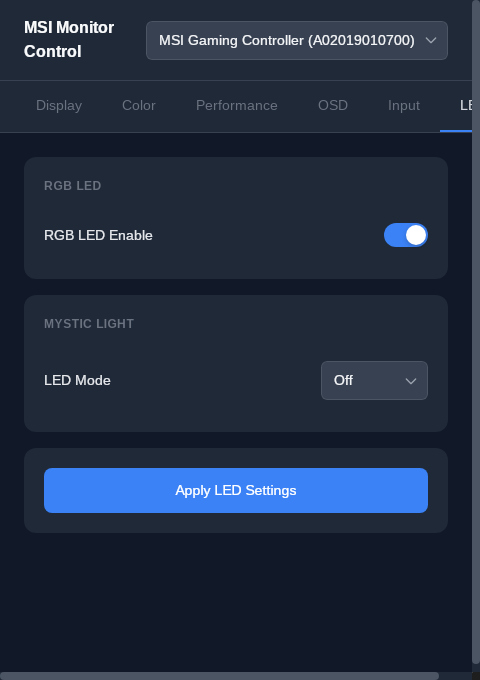

# MSI Monitor Control

A modern desktop GUI application for controlling MSI gaming monitors on Linux. Built with [Tauri 2.0](https://tauri.app/) (Rust backend) and [Svelte 5](https://svelte.dev/) (TypeScript frontend).

  



## Features

- **Display Settings** - Brightness, contrast, sharpness, response time, eye saver mode
- **Color Management** - Color temperature presets and RGB fine-tuning
- **Performance** - HDCR, FreeSync, game modes, pro modes
- **OSD Settings** - Transparency, timeout, refresh rate display, screen assistance
- **Input Control** - Input source, auto scan, HDMI CEC, KVM, audio settings
- **LED Control** - MSI Mystic Light RGB modes (Static, Breathing, Rainbow, etc.)
- **Multi-Monitor Support** - Switch between connected MSI monitors
- **Settings Persistence** - All settings cached locally and survive app restarts

## Screenshots

<table>
  <tr>
    <td><br/><em>Display Settings</em></td>
    <td><br/><em>Color Management</em></td>
  </tr>
  <tr>
    <td><br/><em>Performance</em></td>
    <td><br/><em>OSD Settings</em></td>
  </tr>
  <tr>
    <td><br/><em>Input Control</em></td>
    <td><br/><em>LED Control</em></td>
  </tr>
</table>

## Requirements

- Linux (tested on Arch Linux with KDE Plasma)
- [msigd](https://github.com/couriersud/msigd) CLI tool installed
- USB connection to MSI monitor
- Proper udev rules for HID access

## Installation

### Prerequisites

**1. Install msigd CLI tool:**
```bash
git clone https://github.com/couriersud/msigd.git
cd msigd
make
sudo make install
```

**2. Set up udev rules** (for USB access without root):
```bash
sudo cp 99-msigd.rules /etc/udev/rules.d/
sudo udevadm control --reload-rules
```

**3. System dependencies:**
```bash
# Arch Linux
sudo pacman -S webkit2gtk-4.1

# Ubuntu/Debian
sudo apt install libwebkit2gtk-4.1-0 libgtk-3-0
```

### Arch Linux (AUR)

```bash
# From AUR (build from source)
yay -S msigd-gui

# Or binary package
yay -S msigd-gui-bin
```

### Debian/Ubuntu (.deb)

```bash
# Download from GitHub releases
wget https://github.com/aydiler/msigd-gui/releases/download/v1.1.1/MSI.Monitor.Control_1.1.1_amd64.deb
sudo dpkg -i "MSI.Monitor.Control_1.1.1_amd64.deb"
```

### Snap

```bash
sudo snap install msigd-gui
```

### Build from Source

```bash
git clone https://github.com/aydiler/msigd-gui.git
cd msigd-gui
npm install
npm run tauri build

# Install system-wide
sudo ./install.sh

# Or run directly
./msigd-gui.sh
```

### Uninstall

```bash
sudo ./uninstall.sh
```

## Development

```bash
npm install           # Install dependencies
npm run tauri dev     # Run with hot reload
npm test              # Run E2E tests
npm run test:ui       # Run tests with UI
```

## Architecture

```
Svelte UI → Tauri IPC → Rust Commands → msigd CLI → Monitor Hardware
```

| Layer | Technology |
|-------|------------|
| Frontend | Svelte 5, TypeScript, Vite |
| Backend | Rust, Tauri 2.0 |
| Testing | Playwright |
| Monitor API | msigd CLI |

## Supported Monitors

Any MSI monitor supported by [msigd](https://github.com/couriersud/msigd):
- MSI MAG series (MAG274QRF-QD, MAG271CQR, etc.)
- MSI MPG series
- MSI Optix series

## License

MIT

## Credits

- [msigd](https://github.com/couriersud/msigd) - CLI tool for MSI monitor control
- [Tauri](https://tauri.app/) - Desktop app framework
- [Svelte](https://svelte.dev/) - Frontend framework
